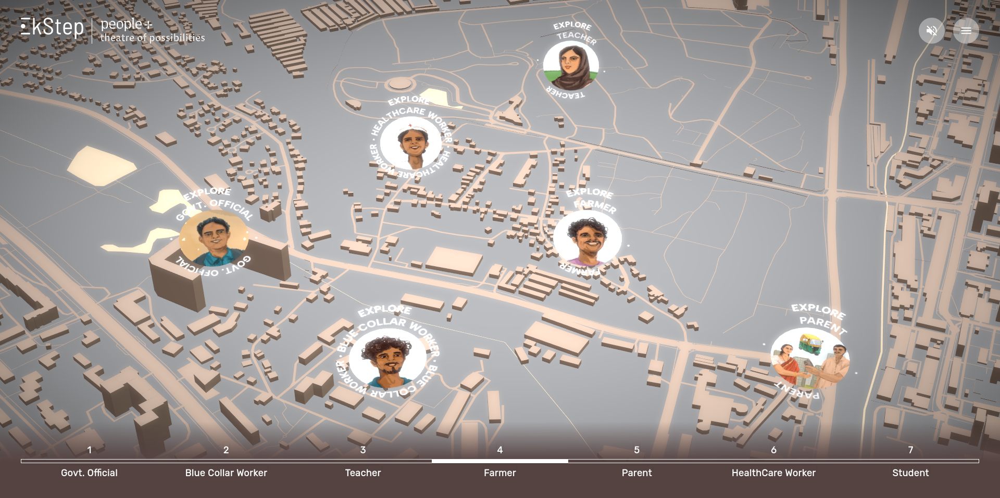

</img>
<br/>
 

## quick setup ⚡

```bash
   git clone https://github.com/high-haseeb/ek-step-top
   npm install
   # for local development
   npm run dev
   # for production
   npm run build
```

## configuration ⚙️

<br/>
The different personas are defined in a json format in the file @/store/store.js. Each persona has these properties that can be configured and new persons can be added easily

| Property     | Description                                    | Data Type     | Example                                   |
| ------------ | ---------------------------------------------- | ------------- | ----------------------------------------- |
| name         | Name of the persona                            | String        | "Govt. Official"                          |
| imageUrl     | URL of the persona's display image             | String        | "/images/ProfilePhotos_0000_Official.jpg" |
| nameImageUrl | URL of the image displaying the persona's name | String        | "/images/Theatre_V4-12 (1).png"           |
| x            | X-coordinate of the persona's location         | Number        | 1                                         |
| y            | Y-coordinate of the persona's location         | Number        | 3                                         |
| personaImage | URL of the detailed slide/image about persona  | String        | "/images/Pop Ups V2/GovtOfficial.jpg"     |
| links        | Array of objects containing titles and URLs    | Array<Object> | See below                                 |

| links | Array of objects containing titles and URLs | Data Type |
| ----- | ------------------------------------------- | --------- |
| title | Title of the link                           | String    |
| url   | URL of the link                             | String    |

<br/>

> Made with :heart: and :coffee: by haseeb. Copyright (c) 2024 Ek-Step. All Rights Reserved.
